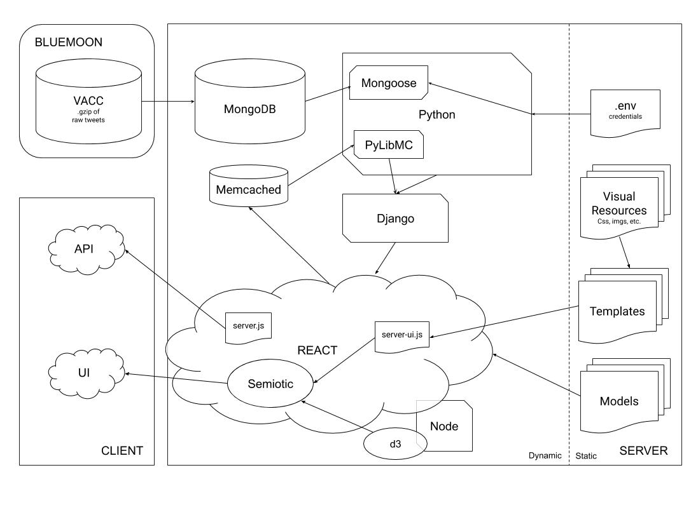

# Twitter Onegram Viewer
## Current prototyping environment for front-end interfaces
There are two methods for accessing onegrams:


### API
The API is built using Node.js with Express. It accesses the Mongo database using Mongoose, a Node package, and pulls credentials from .env.


To use the API from a local machine:
- `ssh username@hydra.uvm.edu`
- Clone this Github repository to your user folder on Hydra
- `node server.js`
- In another Terminal window:
- `ssh -N -L localhost:3001:localhost:3001 username@hydra.uvm.edu`
- Visit http://localhost:3001/api/onegrams/christmas (or whatever word you would like to query)

### UI
The UI is currently generated from a Jupyter Notebook using Dash (a Flask-based graphing dashboard from Plotly). This will be replaced in the future by a React app, likely running D3 with Semiotic.


To use the UI from a local machine:
- `ssh username@hydra.uvm.edu`
- Clone this Github repository to your user folder on Hydra
- Set up a testing environment called `test_env` using `source activate test_env` and install the dependencies listed in `requirements.txt`
- `jupyter notebook --port=9994`
- In another Terminal window, mirror the Jupyter notebook:
- `ssh -N -L localhost:9994:localhost:9994 username@hydra.uvm.edu`
- Open `hydra_dash_test.ipynb` and run using `test_env` as the kernel
- In another Terminal window, mirror the Flask app running on Hydra:
- `ssh -N -L localhost:8050:localhost:8050 username@hydra.uvm.edu`
- Visit http://127.0.0.1:8050/

To forward the UI to the web:
- Install [forwardhq](https://forwardhq.com/) to your Chrome browser
- Visit http://127.0.0.1:8050/ in Chrome
- Use the `forwardhq` browser extension to forward to your chosen URL:
    - e.g. `http://localhost:8050/ >> onegram.fwd.wf`
### Future Plans
This is an approximate rendering of the final full stack of the data visualization process, generating both a UI and API via a MERN stack.



```python

```
