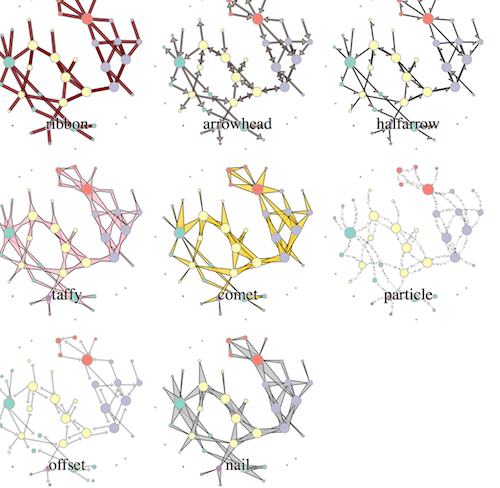

# d3-glyphedge

A bunch of different edge generators for you to use in any data visualization product where you need to graphically represent the connection of one thing to another, like a network diagram or dendrogram.

[Examples of all the edges](http://bl.ocks.org/emeeks/aaa995cde6621745e906)

## Installing

If you use NPM, `npm install d3-glyphedge`. Otherwise, download the [latest release](https://github.com/d3/d3-glyphEdges/releases/latest).

You can install each type of edge separately by importing the particular function.

If you want to do it the old-fashioned way, just download [d3-glyphEdge.js](https://github.com/emeeks/d3-glyphEdges/blob/master/build/d3-glyphEdge.js) or [d3-glyphEdge.min.js](https://github.com/emeeks/d3-glyphEdges/blob/master/build/d3-glyphEdge.min.js).

## API Reference

There are three categories of edges with 10 types of edges available here:

### d3_glyphEdge.d

These functions return drawing instructions for `svg:path` elements.

<a href="#lineArc" name="lineArc">#</a> <b>lineArc</b>(edge)

A simple arc edge. Unlike the rest of the edges, this is drawn as a line and cannot be filled and can only be styled using stroke and stroke-width.

<a href="#ribbon" name="ribbon">#</a> <b>Ribbon</b>(edge, width)

A very simple filled, straight edge drawn with the width specified.

<a href="#arrowhead" name="arrowhead">#</a> <b>Arrowhead</b>(edge, targetSize, arrowlineWidth, arrowheadSize)

An arrow drawn with a line thickness specified and arrowhead size specified that terminates at the edge of the target node (or wherever targetSize specified).

<a href="#halfarrow" name="halfarrow">#</a> <b>halfArrow</b>(edge, targetSize, arrowlineWidth, arrowheadSize)

Half an arrow drawn with a line thickness specified and arrowhead size specified that terminates at the edge of the target node (or wherever targetSize specified). This is useful for bidirectional graphs because the two edges join along a seam and indicate reciprocity in a graphically distinct way.

<a href="#nail" name="nail">#</a> <b>Nail</b>(edge, sourceSize)

A filled triangular edge drawn in such a way that the thick end of the triangle designates the source.

<a href="#comet" name="comet">#</a> <b>Comet</b>(edge, targetSize)

A filled triangular edge drawn in such a way that the thick end of the triangle designates the target.

<a href="#taffy" name="taffy">#</a> <b>Taffy</b>(edge, sourceSize, targetSize, midpointWidth)

An edge drawn so that it has fat edges at each node while tapering at the midpoint between the nodes to the width specified.

### d3_glyphEdge.project

These functions return a new object of the traditional `{source: {x, y}, source: {x, y}}` format based on the object and parameters sent in. The object returned can be used to draw a simple `svg:line` or passed to one of the generator functions to actually draw the edge.

<a href="#offset" name="offset">#</a> <b>Offset</b>(edge, sourceSize, targetSize)

Offset Edges Example

Offset edges are drawn such that reciprocating edges will not overlap each other. This is for directed networks without parallel edges. For networks with parallel edges, use the next function.

<a href="#parallel" name="parallel">#</a> <b>Parallel</b>(edge, sourceSize, targetSize, edgeNumber)

Parallel Edges Example

Parallel edges require an edge number to also be passed along with the edge object, source size and target size. The edgeNumber is the ordinal value for that edge in the parallel edges associated with the same connection from source to target (so if there are five parallel edges from node A to node B, then each one would require an edgeNumber from 1 to 5);

### d3_glyphEdge.mutate

These functions mutate the data sent to the function and as such typically require some kind of initial formatting of the object being sent.

<a href="#particle" name="particle">#</a> <b>Particle</b>(edge, pathNode, edgeWidth, speed)

Particle Edges Example

d3_glyphEdge.mutate.particle requires an edge sent to it with the standard `source` and `target` properties but also requires a `particles` property that should be an empty array and a `frequency` property with a number over 0. `edge.particles` will be populated with objects that have x and y coordinates for each particle, with the number of particles added to the array during every call equal to the number in `edge.frequency`. If `edge.frequency` is less than 1, then it is the percent chance that a particle will be added. During every tick, each particle's xy position will be updated to move it along the path of the edge at `speed` (in pixels). Once a particle has reached the end of the path, it will be dropped from the array. Particles are only added and updated when `glyphEdge.mutate.particle` is called on that edge, so you'll need to call it from a tick event (such as the `d3.layout.force` tick event or a similar tick event created with `d3.timer` or the like.) If you're dealing with a large number of particles, you will likely want to use canvas for rendering rather than SVG.

